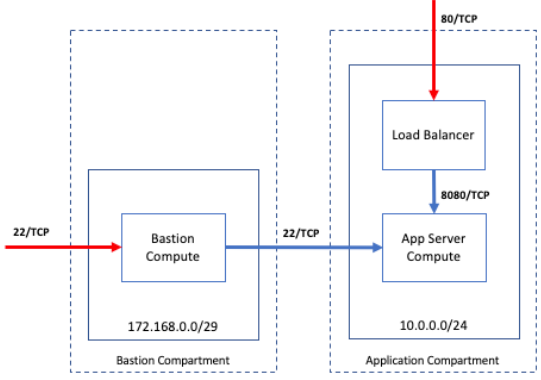

# DevOps Challenge

## Prerequisites

- Permission to `manage` the following types of resources in your Oracle Cloud Infrastructure tenancy: `vcns`, `internet-gateways`, `route-tables`, `network-security-groups`, `subnets`, `autonomous-database-family`, and `instances`.

- Quota to create the following resources: 1 VCN, 3 subnets, 1 Internet Gateway, 1 NAT Gateway, 2 route rules, 1 ATP instance, and 3 compute instances (bastion host + 2 Tomcat servers).


## Deploy Using the Terraform CLI


### Prerequisites
First off, you'll need to do some pre-deploy setup. 

Create a `terraform.tfvars` file, and specify the following variables:

```
# Authentication
tenancy_ocid         = "<tenancy_ocid>"
user_ocid            = "<user_ocid>"
fingerprint          = "<finger_print>"
private_key_path     = "<pem_private_key_path>"

# Region
region = "<oci_region>"

# Compartment
compartment_ocid = "<compartment_ocid>"

# ATP instance Password 
atp_password = "<atp_password>"

# Number of Tomcat nodes (optional)
numberOfNodes = 2

# Customer SSH Public Key (optional)
ssh_public_key = "<ssh_public_key>"
````

### Create the Resources
Run the following commands:

    terraform init
    terraform plan
    terraform apply


### Testing your Deployment
After the deployment is finished, you can test that your Tomcat was deployed correctly 
````
todoapp_url = http://xxx.xxx.xxx.xx/todoapp/list
`````


As the load balancer alternates between the 2 Tomcat nodes, the session data should persist.

### Destroy the Deployment
When you no longer need the deployment, you can run this command to destroy the resources:

    terraform destroy

## Architecture Diagram


## Reference Archirecture
Technical Challenge .
## 